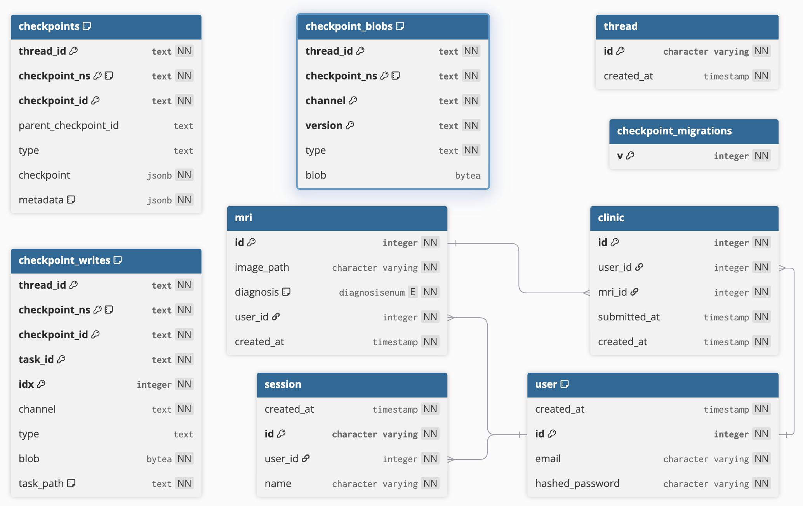

The database is a systematically organized model that provides storage and management of user data, medical images, clinical submissions, user sessions, and checkpoints for computational processes. The architecture is built in a modular fashion: user and medical procedure data form the application layer, while checkpoint tables constitute the technical layer, responsible for the resilience and reproducibility of computations.

The central table is **user**, which stores the main information about system users, including a unique identifier, email address, hashed password, and registration date. This table is referenced by MRI scans, clinical records, and user sessions, ensuring data integrity and consistency.

The **mri** table, associated with users, stores data about medical images. Each record contains a unique scan identifier, the path to the image file, a diagnosis, and a reference to the user who uploaded the scan.

The **clinic** table acts as a link between users and their scans. It reflects the submission of a scan to a clinic or doctor for analysis. Each record contains references to the user and the corresponding scan, as well as timestamps for submission and record creation. Thus, the **clinic** table records the clinical submission process, allowing tracking of when and by whom medical data was transferred.

The **session** table is used to store information about user sessions. It contains the session ID, a reference to the user, the session name, and its creation time. This element of the model is necessary for organizing the authentication mechanism and tracking user activity.

In the technical block of the database, the **thread** table holds a central place, describing a computation flow or task execution. It is used to group related checkpoints—system states saved at specific stages.

The table **checkpoints** stores system states, including thread and checkpoint IDs, type, and metadata in JSON format. This allows restoring the system state at any point in time. The **checkpoint_blobs** table is designed to store binary data associated with checkpoints, such as intermediate computational results. It is linked to threads via the `thread_id` and ensures data integrity between textual and binary components of checkpoints.

The **checkpoint_writes** table logs the checkpoint writing process. It stores data about tasks, indexes, and channels, as well as binary data reflecting the steps of computation. This allows tracking and analyzing the sequence of operations.

The **checkpoint_migrations** table serves an auxiliary function and is used to track checkpoint migration versions. It ensures the possibility of updating the data structure without losing compatibility or historical information.
